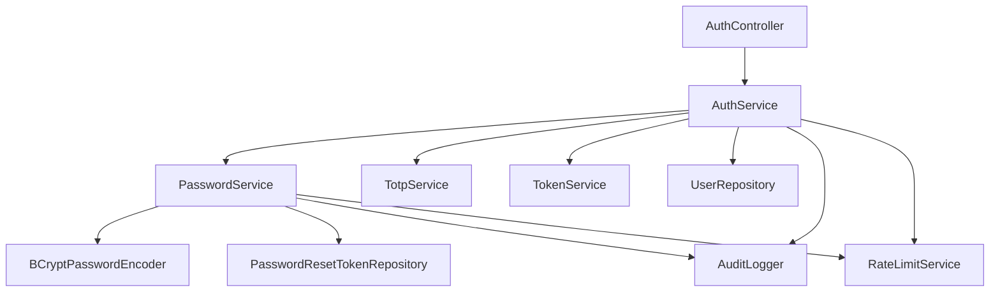

# Design Document: Password Authentication

## Overview

This design document describes the implementation of password-based authentication for the Abrolhos backend application. The system will add password authentication alongside the existing TOTP authentication, requiring users to provide username + password + TOTP code for authentication.

The implementation follows the existing hexagonal/layered architecture with Domain-Driven Design principles. It leverages existing infrastructure including EncryptionService, AuditLogger, RateLimitService, and the Micrometer metrics system.

### Key Design Decisions

1. **Bcrypt for Password Hashing**: Use bcrypt with work factor 12 for secure password hashing with built-in salt generation
2. **Multi-Factor Authentication**: Require both password and TOTP for all authentication attempts
3. **Password Reset Tokens**: Use cryptographically secure tokens with 1-hour expiration
4. **Rate Limiting**: Leverage existing Redis-based rate limiting to prevent brute-force attacks
5. **Audit Logging**: Use existing audit infrastructure for all password-related events
6. **Backward Compatibility**: Support existing TOTP-only users with nullable password field

## Architecture

### Layer Structure

Following the existing hexagonal architecture:

```
Domain Layer (Core Business Logic)
├── Value Objects: PasswordHash, PasswordResetToken, PlaintextPassword
├── Entities: User (extended with passwordHash field)
├── Exceptions: InvalidPasswordException, PasswordResetException
└── Repository Interfaces: PasswordResetTokenRepository

Application Layer (Use Cases)
├── Services: PasswordService, AuthService (extended)
└── Configuration: PasswordProperties

Infrastructure Layer (Technical Implementation)
├── Persistence: PasswordResetTokenEntity, UserEntity (extended)
├── Web: AuthController (extended), PasswordController
└── Database: Flyway migrations for schema changes
```

### Component Interaction



## Components and Interfaces

### 1. Domain Layer

#### Value Objects

**PlaintextPassword**
```kotlin
@JvmInline
value class PlaintextPassword(val value: String) {
    init {
        require(value.isNotBlank()) { "Password cannot be blank" }
        require(value.length <= 128) { "Password cannot exceed 128 characters" }
    }
}
```

**PasswordHash**
```kotlin
@JvmInline
value class PasswordHash(@get:JsonValue val value: String) {
    init {
        require(value.isNotBlank()) { "Password hash cannot be blank" }
        require(value.startsWith("\$2a\$") || value.startsWith("\$2b\$") || value.startsWith("\$2y\$")) {
            "Password hash must be in bcrypt format"
        }
    }
}
```

**PasswordResetToken**
```kotlin
@JvmInline
value class PasswordResetToken(@get:JsonValue val value: String) {
    companion object {
        const val TOKEN_LENGTH = 64 // 256 bits as hex string
        private val HEX_REGEX = Regex("^[a-f0-9]{64}$")
    }
    
    init {
        require(value.length == TOKEN_LENGTH) { "Password reset token must be 64 characters" }
        require(HEX_REGEX.matches(value)) { "Password reset token must be hexadecimal" }
    }
}
```

#### Extended User Entity

```kotlin
data class User(
    val id: ULID,
    val username: Username,
    val totpSecret: TotpSecret?,
    val passwordHash: PasswordHash?,  // Nullable during migration period
    val isActive: Boolean,
    val role: Role,
    val createdAt: OffsetDateTime,
    val updatedAt: OffsetDateTime,
)
```

#### Password Reset Token Entity

```kotlin
data class PasswordResetTokenEntity(
    val id: ULID,
    val userId: ULID,
    val token: PasswordResetToken,
    val expiresAt: OffsetDateTime,
    val createdAt: OffsetDateTime,
) {
    fun isExpired(): Boolean = OffsetDateTime.now().isAfter(expiresAt)
}
```

#### Exceptions

```kotlin
sealed class PasswordException(message: String) : RuntimeException(message)

class InvalidPasswordException(message: String) : PasswordException(message)
class PasswordResetException(message: String) : PasswordException(message)
class PasswordPolicyViolationException(val violations: List<String>) : 
    PasswordException("Password does not meet policy requirements: ${violations.joinToString(", ")}")
```

#### Repository Interface

```kotlin
interface PasswordResetTokenRepository {
    fun save(token: PasswordResetTokenEntity): PasswordResetTokenEntity
    fun findByToken(token: PasswordResetToken): PasswordResetTokenEntity?
    fun deleteById(id: ULID)
    fun deleteExpiredTokens()
    fun deleteByUserId(userId: ULID)
}
```

### 2. Application Layer

#### PasswordService

```kotlin
@Service
class PasswordService(
    private val passwordEncoder: PasswordEncoder,  // Spring Security's PasswordEncoder interface
    private val passwordResetTokenRepository: PasswordResetTokenRepository,
    private val auditLogger: AuditLogger,
    private val rateLimitService: RateLimitService,
    private val meterRegistry: MeterRegistry,
    private val passwordProperties: PasswordProperties,
    private val secureRandom: SecureRandom
) {
    companion object {
        private const val PERFORMANCE_THRESHOLD_MS = 500L
    }
    
    /**
     * Validates a password against the password policy.
     * Returns a list of validation errors, empty if valid.
     */
    fun validatePassword(password: PlaintextPassword): List<String>
    
    /**
     * Hashes a password using bcrypt.
     * Validates the password before hashing.
     */
    fun hashPassword(password: PlaintextPassword): PasswordHash
    
    /**
     * Verifies a plaintext password against a stored hash.
     * Uses BCrypt's constant-time comparison internally.
     */
    fun verifyPassword(password: PlaintextPassword, hash: PasswordHash): Boolean
    
    /**
     * Changes a user's password after verifying the current password.
     * Enforces rate limiting and audit logging.
     */
    fun changePassword(
        userId: ULID,
        currentPassword: PlaintextPassword,
        newPassword: PlaintextPassword,
        currentHash: PasswordHash
    ): PasswordHash
    
    /**
     * Generates a password reset token for a user.
     * Enforces rate limiting and audit logging.
     */
    fun generateResetToken(userId: ULID, username: Username): PasswordResetToken
    
    /**
     * Validates and consumes a password reset token, setting a new password.
     * Enforces rate limiting and audit logging.
     */
    fun resetPassword(
        token: PasswordResetToken,
        newPassword: PlaintextPassword
    ): ULID
    
    /**
     * Cleans up expired password reset tokens.
     * Should be called periodically by a scheduled task.
     */
    @Scheduled(cron = "\${security.password.cleanup-cron:0 0 * * * *}")
    fun cleanupExpiredTokens()
    
    /**
     * Generates a cryptographically secure token using SecureRandom.
     */
    private fun generateSecureToken(): PasswordResetToken {
        val bytes = ByteArray(passwordProperties.resetTokenByteSize)
        secureRandom.nextBytes(bytes)
        return PasswordResetToken(bytes.joinToString("") { "%02x".format(it) })
    }
}
```

#### Extended AuthService

```kotlin
@Service
class AuthService(
    private val userRepository: UserRepository,
    private val inviteRepository: InviteRepository,
    private val totpService: TotpService,
    private val passwordService: PasswordService,  // NEW
    private val tokenService: TokenService,
    private val metricsService: MetricsService,
    private val auditLogger: AuditLogger,
    private val rateLimitService: RateLimitService
) {
    /**
     * Extended login method requiring password + TOTP.
     * Verifies password before TOTP to fail fast.
     */
    @Transactional(readOnly = true)
    fun login(
        username: Username,
        password: PlaintextPassword,  // NEW
        totpCode: TotpCode
    ): String
    
    /**
     * Extended activation method requiring password + TOTP.
     * Sets password during account activation.
     */
    @Transactional
    fun activateAccount(
        inviteToken: InviteToken,
        password: PlaintextPassword,  // NEW
        totpCode: TotpCode
    ): String
}
```

#### Configuration

```kotlin
@ConfigurationProperties(prefix = "security.password")
data class PasswordProperties(
    val minLength: Int = 12,
    val maxLength: Int = 128,
    val requireUppercase: Boolean = true,
    val requireLowercase: Boolean = true,
    val requireDigit: Boolean = true,
    val requireSpecialChar: Boolean = true,
    val bcryptStrength: Int = 12,
    val specialChars: String = "!@#\$%^&*()_+-=[]{}|;:,.<>?",
    val resetTokenExpiryHours: Long = 1,
    val resetTokenByteSize: Int = 32
)

@Configuration
@EnableConfigurationProperties(PasswordProperties::class)
class PasswordConfiguration {
    
    @Bean
    fun passwordEncoder(properties: PasswordProperties): PasswordEncoder {
        return BCryptPasswordEncoder(properties.bcryptStrength)
    }
    
    @Bean
    @ConditionalOnMissingBean
    fun secureRandom(): SecureRandom = SecureRandom()
}
```

### 3. Infrastructure Layer

#### JPA Entities

**Extended UserEntity**
```kotlin
@Entity
@Table(name = "users")
open class UserEntity(
    @Column(name = "username", nullable = false, unique = true, length = 50)
    open var username: String,
    
    @Convert(converter = TotpSecretConverter::class)
    @Column(name = "totp_secret", nullable = true, length = 255)
    open var totpSecret: String?,
    
    @Column(name = "password_hash", nullable = true, length = 60)  // Nullable during migration
    open var passwordHash: String?,
    
    @Column(name = "is_active", nullable = false)
    open var isActive: Boolean,
    
    @Enumerated(EnumType.STRING)
    @Column(name = "role", nullable = false, length = 20)
    open var role: Role,
) : BaseEntity()
```

**PasswordResetTokenEntity**
```kotlin
@Entity
@Table(
    name = "password_reset_tokens",
    indexes = [
        Index(name = "idx_password_reset_token", columnList = "token"),
        Index(name = "idx_password_reset_expires_at", columnList = "expires_at")
    ]
)
open class PasswordResetTokenEntity(
    @Column(name = "user_id", nullable = false, length = 26)
    open var userId: String,
    
    @Column(name = "token", nullable = false, unique = true, length = 64)
    open var token: String,
    
    @Column(name = "expires_at", nullable = false)
    open var expiresAt: OffsetDateTime,
) : BaseEntity()
```

#### Repository Implementation

```kotlin
@Repository
class PasswordResetTokenRepositoryImpl(
    private val jpaRepository: PasswordResetTokenJpaRepository
) : PasswordResetTokenRepository {
    override fun save(token: PasswordResetTokenEntity): PasswordResetTokenEntity {
        val entity = PasswordResetTokenEntity(
            userId = token.userId.toString(),
            token = token.token.value,
            expiresAt = token.expiresAt
        )
        val saved = jpaRepository.save(entity)
        return token.copy(id = ULID.parseULID(saved.id))
    }
    
    override fun findByToken(token: PasswordResetToken): PasswordResetTokenEntity? {
        return jpaRepository.findByToken(token.value)?.toDomain()
    }
    
    override fun deleteById(id: ULID) {
        jpaRepository.deleteById(id.toString())
    }
    
    override fun deleteExpiredTokens() {
        jpaRepository.deleteByExpiresAtBefore(OffsetDateTime.now())
    }
    
    override fun deleteByUserId(userId: ULID) {
        jpaRepository.deleteByUserId(userId.toString())
    }
}

interface PasswordResetTokenJpaRepository : JpaRepository<PasswordResetTokenEntity, String> {
    fun findByToken(token: String): PasswordResetTokenEntity?
    fun deleteByExpiresAtBefore(expiresAt: OffsetDateTime)
    fun deleteByUserId(userId: String)
}
```

#### Web Layer

**PasswordController**
```kotlin
@RestController
@RequestMapping("/api/password")
@Validated
class PasswordController(
    private val passwordService: PasswordService,
    private val userRepository: UserRepository
) {
    
    @PostMapping("/change")
    @PreAuthorize("isAuthenticated()")
    fun changePassword(
        @AuthenticationPrincipal userId: String,
        @RequestBody @Valid request: ChangePasswordRequest
    ): ResponseEntity<Unit> {
        // Implementation
        return ResponseEntity.noContent().build()
    }
    
    @PostMapping("/reset/request")
    @RateLimited(key = "password-reset", limit = 3, windowSeconds = 3600)
    fun requestPasswordReset(
        @RequestBody @Valid request: PasswordResetRequest
    ): ResponseEntity<Unit> {
        // Implementation - always return success to prevent user enumeration
        return ResponseEntity.accepted().build()
    }
    
    @PostMapping("/reset/confirm")
    fun confirmPasswordReset(
        @RequestBody @Valid request: ConfirmPasswordResetRequest
    ): ResponseEntity<Unit> {
        // Implementation
        return ResponseEntity.noContent().build()
    }
}
```

**DTOs**
```kotlin
data class LoginRequest(
    @field:NotBlank(message = "Username is required")
    val username: String,
    
    @field:NotBlank(message = "Password is required")
    val password: String,
    
    @field:Pattern(regexp = "^[0-9]{6}$", message = "TOTP code must be 6 digits")
    val totpCode: String
)

data class ActivateAccountRequest(
    @field:NotBlank(message = "Invite token is required")
    val inviteToken: String,
    
    @field:NotBlank(message = "Password is required")
    val password: String,
    
    @field:Pattern(regexp = "^[0-9]{6}$", message = "TOTP code must be 6 digits")
    val totpCode: String
)

data class ChangePasswordRequest(
    @field:NotBlank(message = "Current password is required")
    val currentPassword: String,
    
    @field:NotBlank(message = "New password is required")
    val newPassword: String
)

data class PasswordResetRequest(
    @field:NotBlank(message = "Username is required")
    val username: String
)

data class ConfirmPasswordResetRequest(
    @field:NotBlank(message = "Token is required")
    @field:Size(min = 64, max = 64, message = "Invalid token format")
    val token: String,
    
    @field:NotBlank(message = "New password is required")
    val newPassword: String
)

// Response DTOs
data class PasswordValidationErrorResponse(
    val violations: List<String>
)
```

#### Database Migrations

**V2026.02.20.10.00.00__add_password_authentication.sql**
```sql
-- Add password_hash column to users table (nullable initially for migration)
ALTER TABLE users 
ADD COLUMN password_hash VARCHAR(60) NULL;

-- Create password_reset_tokens table
CREATE TABLE password_reset_tokens (
    id VARCHAR(26) PRIMARY KEY,
    user_id VARCHAR(26) NOT NULL,
    token VARCHAR(64) NOT NULL UNIQUE,
    expires_at TIMESTAMP WITH TIME ZONE NOT NULL,
    created_at TIMESTAMP WITH TIME ZONE NOT NULL DEFAULT CURRENT_TIMESTAMP,
    updated_at TIMESTAMP WITH TIME ZONE NOT NULL DEFAULT CURRENT_TIMESTAMP,
    CONSTRAINT fk_password_reset_user FOREIGN KEY (user_id) REFERENCES users(id) ON DELETE CASCADE
);

-- Create indexes for efficient lookups
CREATE INDEX idx_password_reset_token ON password_reset_tokens(token);
CREATE INDEX idx_password_reset_expires_at ON password_reset_tokens(expires_at);
CREATE INDEX idx_password_reset_user_id ON password_reset_tokens(user_id);

-- Add comment for documentation
COMMENT ON COLUMN users.password_hash IS 'Bcrypt hashed password (nullable during migration, will be required)';
COMMENT ON TABLE password_reset_tokens IS 'Stores password reset tokens with 1-hour expiration';
```

**V2026.02.20.11.00.00__make_password_hash_required.sql**
```sql
-- This migration should be run AFTER all existing users have set passwords
-- via the password reset flow

-- Make password_hash NOT NULL
ALTER TABLE users 
ALTER COLUMN password_hash SET NOT NULL;

-- Update comment
COMMENT ON COLUMN users.password_hash IS 'Bcrypt hashed password (required for all users)';
```

## Data Models

### User Entity (Extended)

| Field | Type | Nullable | Description |
|-------|------|----------|-------------|
| id | ULID | No | Unique identifier |
| username | Username | No | Unique username (3-20 chars) |
| totp_secret | TotpSecret | Yes | Encrypted TOTP secret |
| password_hash | PasswordHash | Yes | Bcrypt hashed password (nullable during migration) |
| is_active | Boolean | No | Account activation status |
| role | Role | No | User role (ADMIN, USER) |
| created_at | OffsetDateTime | No | Creation timestamp |
| updated_at | OffsetDateTime | No | Last update timestamp |

### Password Reset Token Entity

| Field | Type | Nullable | Description |
|-------|------|----------|-------------|
| id | ULID | No | Unique identifier |
| user_id | ULID | No | Foreign key to users table |
| token | PasswordResetToken | No | Cryptographically secure token (64 hex chars) |
| expires_at | OffsetDateTime | No | Token expiration timestamp (1 hour from creation) |
| created_at | OffsetDateTime | No | Creation timestamp |

### Password Policy Configuration

| Property | Default | Description |
|----------|---------|-------------|
| minLength | 12 | Minimum password length |
| maxLength | 128 | Maximum password length |
| requireUppercase | true | Require at least one uppercase letter |
| requireLowercase | true | Require at least one lowercase letter |
| requireDigit | true | Require at least one digit |
| requireSpecialChar | true | Require at least one special character |
| bcryptStrength | 12 | Bcrypt work factor (12-14 recommended) |
| specialChars | !@#$%^&*()_+-=[]{}&#124;;:,.<>? | Allowed special characters |


## Correctness Properties

A property is a characteristic or behavior that should hold true across all valid executions of a system—essentially, a formal statement about what the system should do. Properties serve as the bridge between human-readable specifications and machine-verifiable correctness guarantees.

### Property 1: Bcrypt Hash Format and Uniqueness

*For any* valid password, when hashed by the Password_Service, the resulting hash SHALL be in valid bcrypt format (starting with $2a$, $2b$, or $2y$), SHALL include the work factor between 12 and 14, and hashing the same password multiple times SHALL produce different hashes (due to unique salt generation).

**Validates: Requirements 1.1, 1.4, 1.5**

### Property 2: Password Policy Validation

*For any* password string, the Password_Service validation SHALL correctly identify all policy violations including: length requirements (12-128 characters), presence of uppercase letters, lowercase letters, digits, and special characters. Invalid passwords SHALL be rejected with descriptive error messages listing all violations.

**Validates: Requirements 2.1, 2.2, 2.3, 2.4, 2.5, 2.6, 2.7, 2.8**

### Property 3: Password Verification Round-Trip

*For any* valid password that passes policy validation, hashing the password and then verifying the plaintext against the hash SHALL always return true. Verifying any different password against the hash SHALL return false.

**Validates: Requirements 1.1, 3.2**

### Property 4: Authentication Generic Error Messages

*For any* authentication attempt with invalid credentials (wrong password, wrong TOTP, or wrong username), the Auth_Service SHALL return the same generic error message without revealing which credential was incorrect.

**Validates: Requirements 3.3, 3.4, 3.7**

### Property 5: Authentication Requires All Credentials

*For any* authentication attempt, the Auth_Service SHALL require username, password, and TOTP code. When all three are valid, a JWT token SHALL be returned. If any credential is missing or invalid, authentication SHALL fail.

**Validates: Requirements 3.1, 3.2, 12.1**

### Property 6: Account Activation Sets Password

*For any* valid account activation with invitation token, password, and TOTP code, the Auth_Service SHALL validate the password against policy, store the password hash in the User entity, activate the account, and return a JWT token.

**Validates: Requirements 4.2, 4.3, 4.4, 12.4**

### Property 7: Password Change Requires Current Password

*For any* password change request, the Password_Service SHALL verify the current password before allowing the change. If the current password is incorrect, the change SHALL be rejected. The new password SHALL be validated against policy and SHALL not match the current password.

**Validates: Requirements 5.2, 5.3, 5.4**

### Property 8: Password Change Persistence and Audit

*For any* successful password change, the new password hash SHALL be stored and SHALL be usable for subsequent authentication. An audit log entry SHALL be created with user ID and timestamp.

**Validates: Requirements 5.5, 5.6**

### Property 9: Password Reset Token Generation

*For any* password reset request, the Password_Service SHALL generate a cryptographically secure token of exactly 64 hexadecimal characters (256 bits of entropy) with an expiration time exactly 1 hour in the future.

**Validates: Requirements 6.1, 6.2, 6.3**

### Property 10: Password Reset Token Single-Use

*For any* valid password reset token, successfully resetting the password SHALL invalidate the token. Attempting to reuse the same token SHALL fail. Expired tokens SHALL be rejected.

**Validates: Requirements 6.4, 6.6**

### Property 11: Password Reset Audit Logging

*For any* password reset flow (request and completion), audit log entries SHALL be created with appropriate user identification, timestamps, and IP addresses.

**Validates: Requirements 6.7, 8.2, 8.3**

### Property 12: Expired Token Cleanup

*For any* set of password reset tokens, calling the cleanup method SHALL delete all tokens where expires_at is in the past, and SHALL preserve all tokens where expires_at is in the future.

**Validates: Requirements 6.8**

### Property 13: Authentication Rate Limiting

*For any* username, after 5 failed authentication attempts within a 15-minute window, the 6th attempt SHALL be rejected with a rate limit error regardless of credential validity.

**Validates: Requirements 7.1, 7.2**

### Property 14: Password Reset Rate Limiting

*For any* username, after 3 password reset requests within a 1-hour window, the 4th request SHALL be rejected with a rate limit error.

**Validates: Requirements 7.3, 7.4**

### Property 15: Audit Logging for Password Events

*For any* password-related event (change, reset request, reset completion, failed authentication, rate limit), an audit log entry SHALL be created containing the appropriate identifiers (user ID or username), timestamp, IP address, and operation type.

**Validates: Requirements 8.1, 8.2, 8.3, 8.4, 8.5**

### Property 16: Password Operation Performance

*For any* set of password operations (hashing or verification), the 95th percentile duration SHALL be under 500 milliseconds. Operations exceeding this threshold SHALL log warnings and increment metrics.

**Validates: Requirements 9.1, 9.2, 9.3, 9.4**

### Property 17: Password Required for Authentication

*For any* user attempting to authenticate, if the user has no password set (password_hash is null), authentication SHALL fail with an appropriate error message prompting the user to set a password via the reset flow.

**Validates: Requirements 3.1, 12.1**

## Error Handling

### Exception Hierarchy

```kotlin
sealed class PasswordException(message: String) : RuntimeException(message)

class InvalidPasswordException(message: String) : PasswordException(message)
class PasswordResetException(message: String) : PasswordException(message)
class PasswordPolicyViolationException(val violations: List<String>) : 
    PasswordException("Password does not meet policy requirements")
class PasswordResetTokenExpiredException : PasswordException("Password reset token has expired")
class PasswordResetTokenNotFoundException : PasswordException("Invalid password reset token")
class RateLimitExceededException(message: String) : PasswordException(message)
```

### Error Handling Strategy

1. **Validation Errors**: Return detailed validation errors for password policy violations during password change and reset flows
2. **Authentication Errors**: Return generic "Invalid credentials" message for all authentication failures to prevent user enumeration
3. **Rate Limiting Errors**: Return "Too many attempts" message when rate limits are exceeded
4. **Token Errors**: Return generic "Invalid or expired token" message for password reset token issues
5. **Audit All Failures**: Log all error conditions to audit log with appropriate detail for security monitoring

### HTTP Status Codes

| Error Type | Status Code | Response |
|------------|-------------|----------|
| Invalid credentials | 401 Unauthorized | Generic error message |
| Password policy violation | 400 Bad Request | List of violations |
| Rate limit exceeded | 429 Too Many Requests | Retry-After header |
| Invalid reset token | 400 Bad Request | Generic error message |
| Expired reset token | 400 Bad Request | Generic error message |
| Server error | 500 Internal Server Error | Generic error message |

## Testing Strategy

### Dual Testing Approach

This feature requires both unit tests and property-based tests for comprehensive coverage:

- **Unit tests**: Verify specific examples, edge cases, and error conditions
- **Property tests**: Verify universal properties across all inputs

Together, these provide comprehensive coverage where unit tests catch concrete bugs and property tests verify general correctness.

### Property-Based Testing

We will use **Kotest Property Testing** (already in use in the project) for property-based tests. Each property test will:

- Run a minimum of 100 iterations to ensure comprehensive input coverage
- Reference the design document property it validates
- Use the tag format: **Feature: password-authentication, Property {number}: {property_text}**

### Test Configuration

```kotlin
@Tag("password-authentication")
class PasswordServicePropertyTest : FunSpec({
    test("Property 1: Bcrypt Hash Format and Uniqueness")
        .config(invocations = 100) {
        checkAll(Arb.string(12..128)) { password ->
            // Test implementation
        }
    }
})
```

### Unit Testing Focus

Unit tests should focus on:

- Specific examples of valid and invalid passwords
- Edge cases (empty strings, boundary lengths, special character handling)
- Integration points between PasswordService and AuthService
- Error message formatting and HTTP status codes
- Audit log entry format and content
- Database constraint violations

### Property Testing Focus

Property tests should focus on:

- Password hashing produces valid bcrypt format for all inputs
- Password validation correctly identifies all policy violations
- Round-trip properties (hash then verify)
- Rate limiting enforcement across many attempts
- Token generation produces cryptographically secure tokens
- Audit logging creates entries for all events
- Performance characteristics across many operations

### Integration Testing

Integration tests should verify:

- Database migrations create correct schema
- JPA entities map correctly to database tables
- Foreign key constraints work as expected
- Indexes improve query performance
- Transaction boundaries are correct
- Redis rate limiting integration works
- Audit logging integration works

### Test Data Generation

Use Kotest Arb generators for:

```kotlin
// Valid passwords that meet policy
val validPasswordArb = Arb.string(12..128)
    .filter { it.any { c -> c.isUpperCase() } }
    .filter { it.any { c -> c.isLowerCase() } }
    .filter { it.any { c -> c.isDigit() } }
    .filter { it.any { c -> c in "!@#\$%^&*()_+-=[]{}|;:,.<>?" } }

// Invalid passwords for various reasons
val tooShortPasswordArb = Arb.string(1..11)
val tooLongPasswordArb = Arb.string(129..200)
val noUppercasePasswordArb = Arb.string(12..128)
    .filter { it.none { c -> c.isUpperCase() } }

// Usernames
val usernameArb = Arb.string(3..20)
    .filter { it.matches(Regex("^[a-z0-9_]+$")) }

// TOTP codes
val totpCodeArb = Arb.string(6..6)
    .filter { it.all { c -> c.isDigit() } }
```

### Performance Testing

Performance tests should verify:

- Password hashing completes within 500ms at 95th percentile
- Password verification completes within 500ms at 95th percentile
- Metrics are recorded for all operations
- Warnings are logged for slow operations

### Security Testing

Security tests should verify:

- Plaintext passwords are never logged
- Generic error messages prevent user enumeration
- Rate limiting prevents brute-force attacks
- Password reset tokens are cryptographically secure
- Bcrypt work factor is within recommended range (12-14)
- Audit logs capture all security-relevant events

## Implementation Notes

### Spring Boot 3.4 Features Used

1. **@ConfigurationProperties with @EnableConfigurationProperties**: Type-safe configuration binding for password policy settings
2. **Spring Security 6.x PasswordEncoder**: Interface-based password encoding with BCrypt implementation
3. **@Scheduled with configurable cron**: Flexible scheduled task configuration via application properties
4. **@ConditionalOnMissingBean**: Allows test overrides of SecureRandom bean
5. **@Validated and Jakarta Validation**: Request validation with custom error messages
6. **@PreAuthorize**: Method-level security for authenticated endpoints
7. **Spring Data JPA with Kotlin**: Leverages Kotlin's null-safety and data classes

### Kotlin Idioms and Features

1. **Inline Value Classes**: Zero-overhead type safety for PasswordHash, PasswordResetToken, PlaintextPassword
2. **Data Classes**: Immutable domain entities and DTOs with automatic equals/hashCode
3. **Sealed Classes**: Type-safe exception hierarchy for password-related errors
4. **Extension Functions**: Can be used for password validation logic
5. **Null Safety**: Leverages Kotlin's type system to handle nullable password_hash during migration
6. **String Templates**: For error messages and logging
7. **Scope Functions**: `let`, `also`, `apply` for cleaner code
8. **Collection Operations**: `filter`, `map`, `joinToString` for validation and formatting

### Bcrypt Work Factor Selection

The bcrypt work factor should be configured based on performance requirements:

- **Work factor 12**: ~250ms per operation (recommended for most applications)
- **Work factor 13**: ~500ms per operation (higher security, slower)
- **Work factor 14**: ~1000ms per operation (maximum security, may impact UX)

Default to work factor 12 with configuration option to increase.

### Password Reset Token Generation

Use `SecureRandom` bean for cryptographically secure token generation:

```kotlin
@Service
class PasswordService(
    private val secureRandom: SecureRandom,
    private val passwordProperties: PasswordProperties,
    // ... other dependencies
) {
    private fun generateSecureToken(): PasswordResetToken {
        val bytes = ByteArray(passwordProperties.resetTokenByteSize) // 32 bytes = 256 bits
        secureRandom.nextBytes(bytes)
        val hex = bytes.joinToString("") { "%02x".format(it) }
        return PasswordResetToken(hex)
    }
}
```

### Rate Limiting Keys

Use consistent rate limiting keys:

- Authentication: `auth:login:{username}`
- Password reset: `password:reset:{username}`

### Audit Log Event Types

Define consistent event types:

- `PASSWORD_CHANGED`
- `PASSWORD_RESET_REQUESTED`
- `PASSWORD_RESET_COMPLETED`
- `AUTHENTICATION_FAILED_INVALID_PASSWORD`
- `RATE_LIMIT_EXCEEDED`

### Database Indexes

Ensure indexes are created for:

- `password_reset_tokens.token` (unique lookups)
- `password_reset_tokens.expires_at` (cleanup queries)
- `password_reset_tokens.user_id` (user lookups)

### Scheduled Tasks

Use Spring's `@Scheduled` annotation with configurable cron expression:

```kotlin
@Service
@EnableScheduling
class PasswordService(
    // ... dependencies
) {
    @Scheduled(cron = "\${security.password.cleanup-cron:0 0 * * * *}")
    fun cleanupExpiredTokens() {
        val startTime = System.currentTimeMillis()
        val deletedCount = passwordResetTokenRepository.deleteExpiredTokens()
        val duration = System.currentTimeMillis() - startTime
        
        logger.info("Cleaned up $deletedCount expired password reset tokens in ${duration}ms")
        meterRegistry.counter("password.reset.tokens.cleaned").increment(deletedCount.toDouble())
    }
}
```

Configuration in `application.yml`:
```yaml
security:
  password:
    cleanup-cron: "0 0 * * * *"  # Every hour
    min-length: 12
    max-length: 128
    bcrypt-strength: 12
    reset-token-expiry-hours: 1
    reset-token-byte-size: 32
```

### Migration Strategy

For existing TOTP-only users:

1. **Phase 1**: Run first migration to add nullable `password_hash` column and create `password_reset_tokens` table
2. **Phase 2**: For each existing user, generate a password reset token and send it to them (via email, admin console, etc.)
3. **Phase 3**: Users use the password reset flow to set their initial password
4. **Phase 4**: Once all users have passwords set, run second migration to make `password_hash` NOT NULL
5. **Phase 5**: Update domain model to make `passwordHash` non-nullable

This approach leverages the password reset feature for initial password setup, providing a secure and audited way for existing users to set passwords.

Example SQL to generate reset tokens for existing users:
```sql
-- Generate password reset tokens for all users without passwords
INSERT INTO password_reset_tokens (id, user_id, token, expires_at, created_at, updated_at)
SELECT 
    -- Generate ULID for id (use application code or ULID generator)
    gen_ulid(),
    u.id,
    -- Generate secure random token (use application code or secure random generator)
    encode(gen_random_bytes(32), 'hex'),
    NOW() + INTERVAL '7 days',  -- Longer expiry for migration
    NOW(),
    NOW()
FROM users u
WHERE u.password_hash IS NULL;
```
